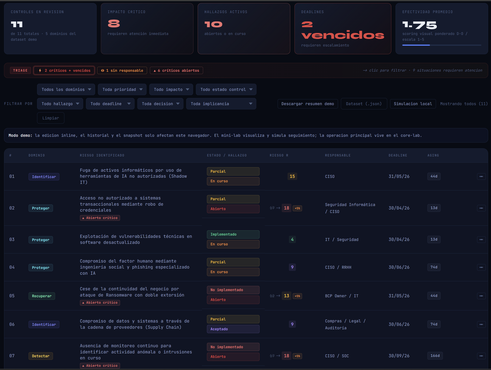
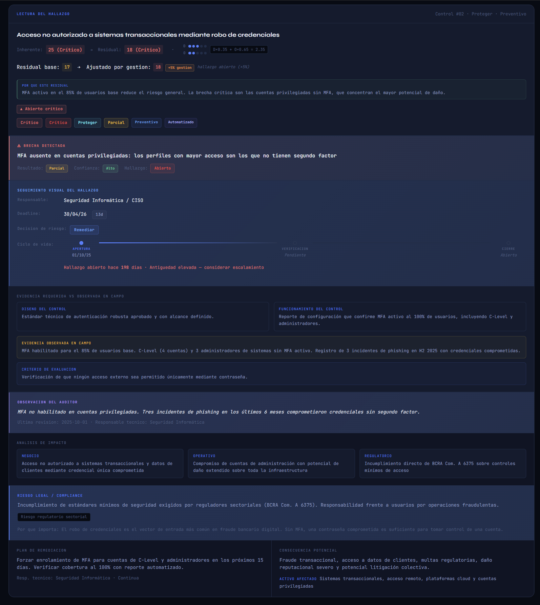

# Cyber Audit Mini Lab

> Demo visual de hallazgos de auditoria para mostrar prioridad, seguimiento, responsable y riesgo residual en una sola vista.

**Live demo:** [mgodoylegal-tech.github.io/cyber-audit-mini-lab](https://mgodoylegal-tech.github.io/cyber-audit-mini-lab)

---

## Que muestra esta demo

Cyber Audit Mini Lab es la **capa visual** del ecosistema LAALT.

Su objetivo no es reemplazar el metodo ni la operacion principal. Su valor esta en hacer visible algo que muchas veces queda disperso en auditoria:

- que hallazgo requiere atencion hoy
- quien figura como responsable
- cuanto tiempo lleva abierto
- que deadline esta vencido o proximo
- como cambia el riesgo residual cuando la gestion es debil

En otras palabras: no muestra solo si un control existe. Muestra **que decision deberia tomar el auditor frente a ese hallazgo**.

---

## Que no es

Este repositorio **no es**:

- la fuente doctrinal principal del metodo
- la capa operativa completa
- un GRC enterprise
- una app multiusuario
- un reemplazo de `cyber-audit-core-lab`

Dentro del ecosistema:

| Proyecto | Rol |
|---|---|
| `cyber-audit-core-lab` | Metodo, doctrina, framework y capa operativa principal |
| `auditor-guide` | Estudio, entrenamiento y razonamiento guiado |
| `cyber-audit-mini-lab` | Visualizacion demo de hallazgos |

---

## El problema que resuelve

Muchos tableros de auditoria responden una pregunta:

**Que tan efectivo es el control?**

Este mini-lab responde una pregunta mas util para gestion y auditoria:

**Que hago con este hallazgo hoy?**

Un control puede estar razonablemente bien disenado y aun asi sostener un riesgo alto si:

- el hallazgo sigue abierto
- el deadline esta vencido
- no hay responsable claro
- la aceptacion del riesgo no tiene respaldo suficiente

La demo esta pensada para hacer visible esa diferencia.

---

## Caso demo recomendado

El caso mas claro para entender la herramienta es el de **MFA ausente en cuentas privilegiadas**.

Ese hallazgo muestra bien el cruce entre:

- control tecnico
- priorizacion
- seguimiento
- riesgo residual
- lectura de compliance y riesgo digital

Si entras por primera vez a la demo, conviene empezar por ese control.

---

## Como leer la interfaz

### 1. Triage

La banda superior resume que requiere atencion hoy:

- criticos vencidos
- hallazgos sin responsable
- hallazgos abiertos criticos
- aceptaciones sin aprobador

### 2. Tabla o cards

La vista principal muestra:

- dominio
- riesgo identificado
- estado del control y del hallazgo
- riesgo residual
- responsable
- deadline y aging

### 3. Panel de detalle

El detalle esta ordenado para ayudar a decidir:

1. brecha detectada
2. seguimiento visible del hallazgo
3. evidencia requerida y observada
4. impacto
5. lectura legal/compliance
6. plan de remediacion

---

## Que decisiones habilita

| Pregunta | Donde aparece |
|---|---|
| Que debo escalar hoy? | Triage + aging + residual |
| Que hallazgo esta peor gestionado? | Deadline, responsable y estado |
| El riesgo residual refleja la gestion real? | Delta residual y penalizacion |
| Que evidencia me falta? | Bloque de evidencia observada vs requerida |
| Cual es la consecuencia de no cerrar esto? | Impacto + riesgo legal/compliance |

---

## Capturas

### Vista general



### Detalle del hallazgo



---

## Dataset demo

El dataset esta armado para mostrar situaciones comprensibles y utiles para auditoria:

- contradicciones entre diseno y operacion
- deadlines vencidos
- responsables ausentes
- aceptaciones mal justificadas
- penalizaciones visibles en el residual

No es un dataset productivo. Es una muestra controlada para explicar criterio.

---

## Stack

| Capa | Tecnologia | Motivo |
|---|---|---|
| Frontend | HTML + CSS + JS vanilla | Demo simple, auditable y facil de compartir |
| Datos | JSON | Fuente versionable y sin backend |
| Hosting | GitHub Pages | Publicacion estatica sin infraestructura extra |

---

## Estructura

```text
cyber-audit-mini-lab/
|-- index.html
|-- script.js
|-- styles.css
|-- data/
|   `-- audit_matrix.json
|-- CHANGELOG.md
`-- README.md
```

---

## Limitaciones conscientes

- la edicion y el historial son solo locales
- no hay persistencia compartida
- no hay autenticacion ni multiusuario
- no reemplaza la capa operativa del core-lab

Ese recorte es deliberado: esta pieza existe para **visualizar bien**, no para competir con el resto del ecosistema.

---

## Valor profesional

Este mini-lab esta pensado como una demostracion concreta de una linea de trabajo mas amplia sobre:

- auditoria legal-tecnica
- compliance y riesgo digital
- lectura de hallazgos de ciberseguridad
- traduccion entre control, seguimiento y decision

Si queres ver la capa metodologica completa, esa vive fuera de este repo.

---

*Matias Godoy - Legal-Tech / Auditoria / Compliance / Ciberseguridad*
